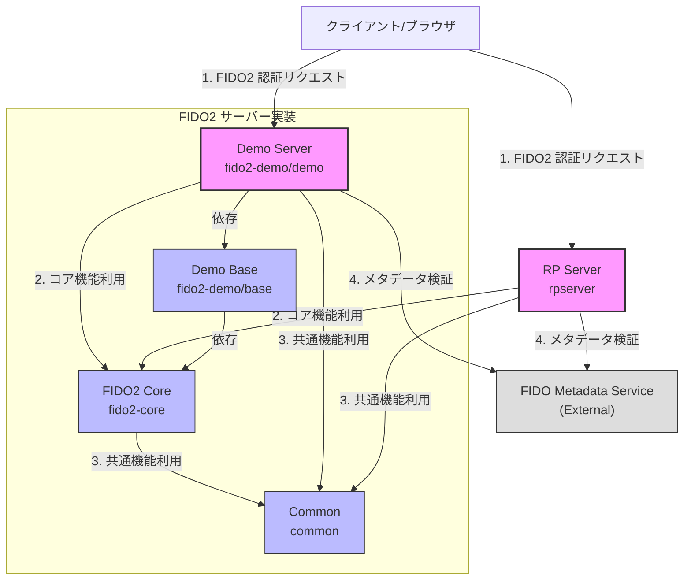
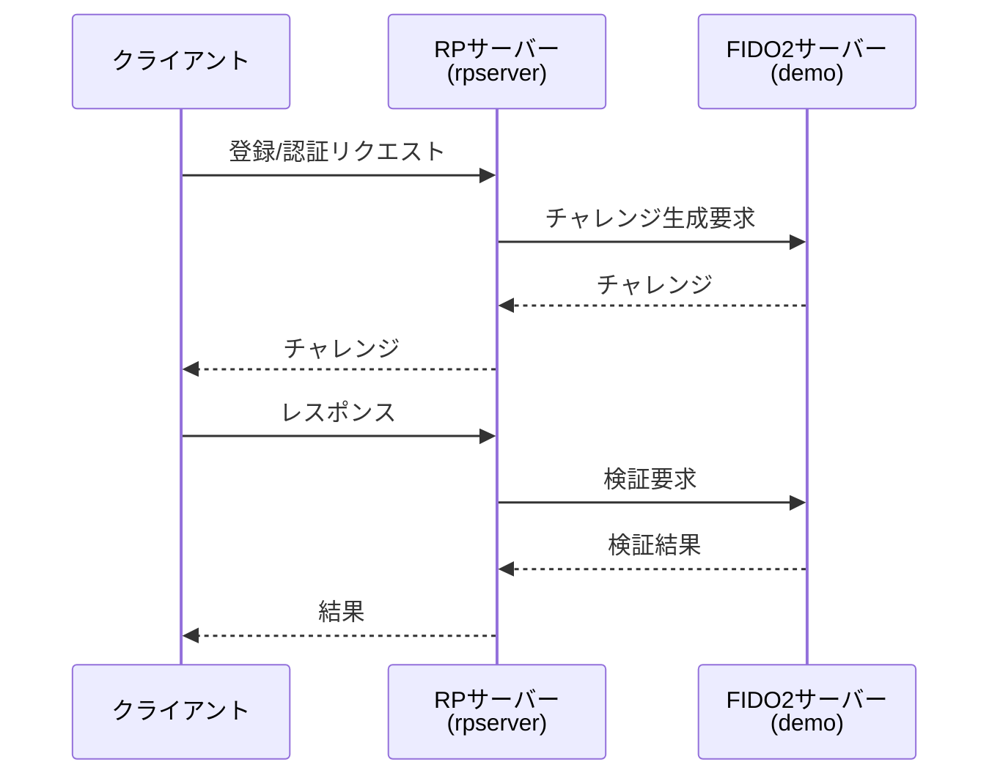

# FIDO2 サーバー実装の構成図

## モジュール関係図

mコードを分析した結果、両サーバーのエンドポイントは以下のようになっています：

rpserver（RPサーバー）のエンドポイント：
認証関連：
```
POST /attestation/options   # 登録チャレンジの取得
POST /attestation/result   # 登録レスポンスの送信
POST /assertion/options    # 認証チャレンジの取得
POST /assertion/result     # 認証レスポンスの送信
```

認証情報管理：
```
GET    /credentials         # ユーザー名による認証情報の取得
GET    /credentials/{id}    # 認証情報IDによる認証情報の取得
DELETE /credentials         # ユーザー名による認証情報の削除
DELETE /credentials/{id}    # 認証情報IDによる認証情報の削除
```
その他：
```
GET /health        # ヘルスチェック
GET /index.html    # メインページ
```
demo（FIDO2サーバー）のエンドポイント：
FIDO2関連：
その他：
重要な観察：
アーキテクチャ上の問題:

現在、rpserverは実際にはFIDO2サーバー（demo）に依存していますが、直接依存ではなく、HTTP経由で通信
rpserverのAdapterControllerは、FIDO2サーバーのエンドポイントを呼び出す中継役として機能
推奨される改善点:

RPサーバー（rpserver）をクライアントの唯一のエントリーポイントとして使用
FIDO2サーバー（demo）をRPサーバーからのみアクセス可能な内部サービスとして配置
セッション管理やユーザー認証をRPサーバーに一元化
実際の依存関係:


    RP-->>Client: チャレンジ
この構造から、現在のプロジェクトはRPサーバーとFIDO2サーバーが分離されているものの、その間の依存関係が必ずしも最適化されていないことがわかります。